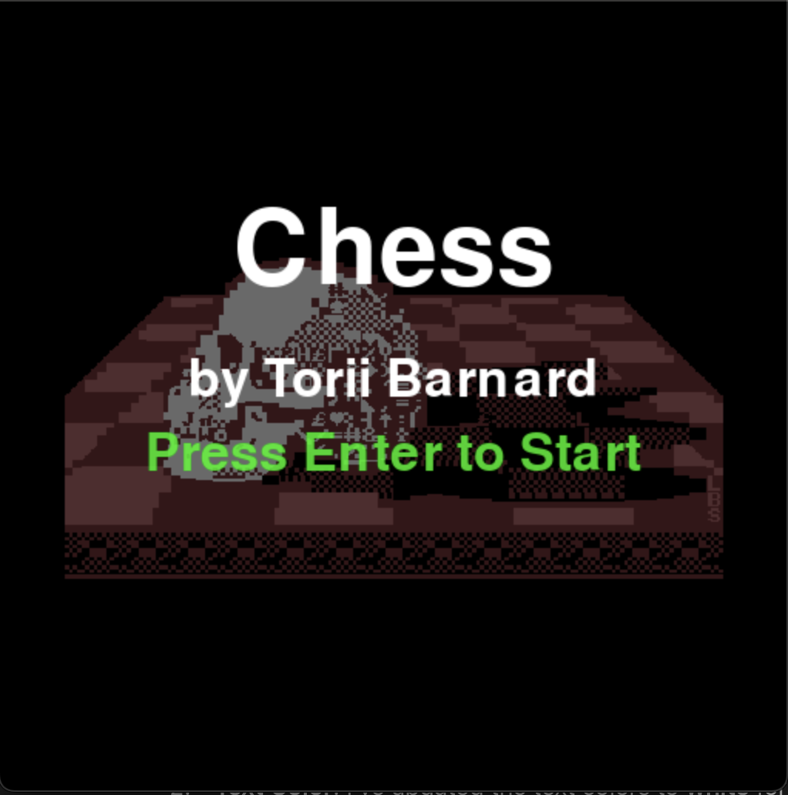
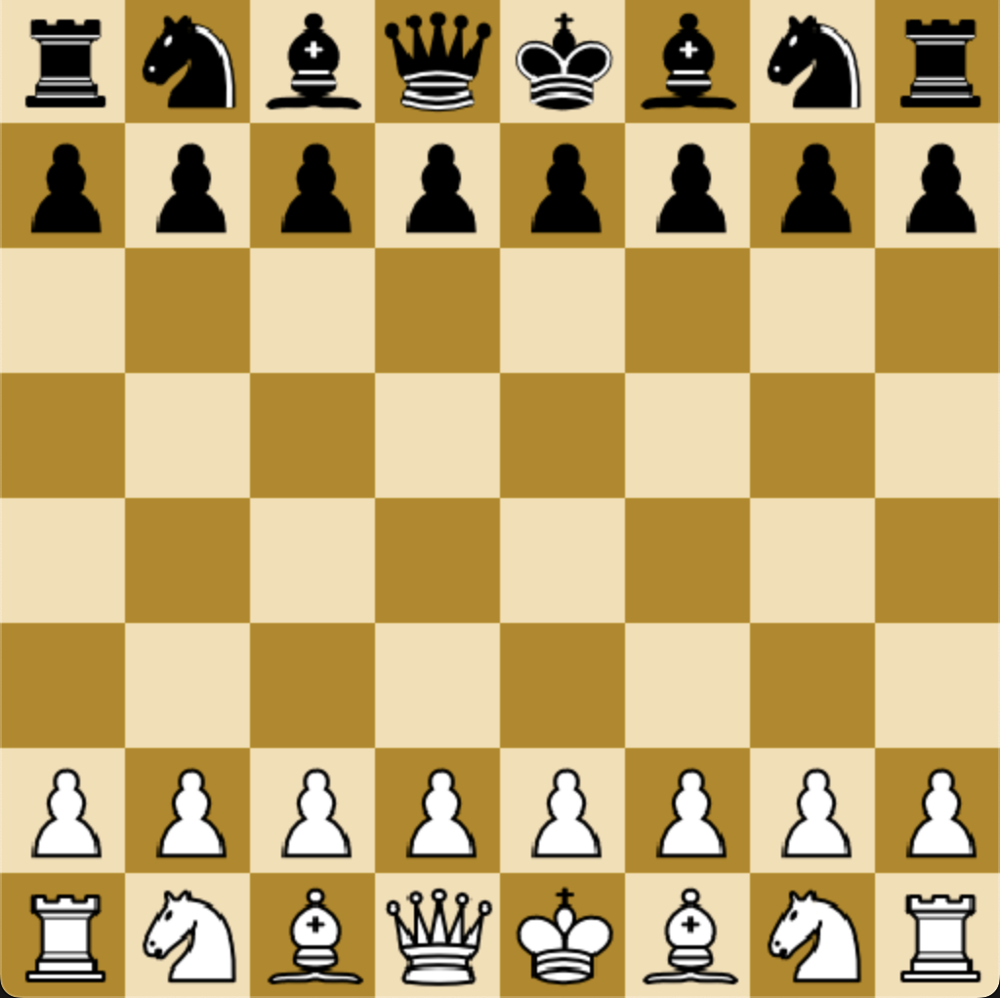
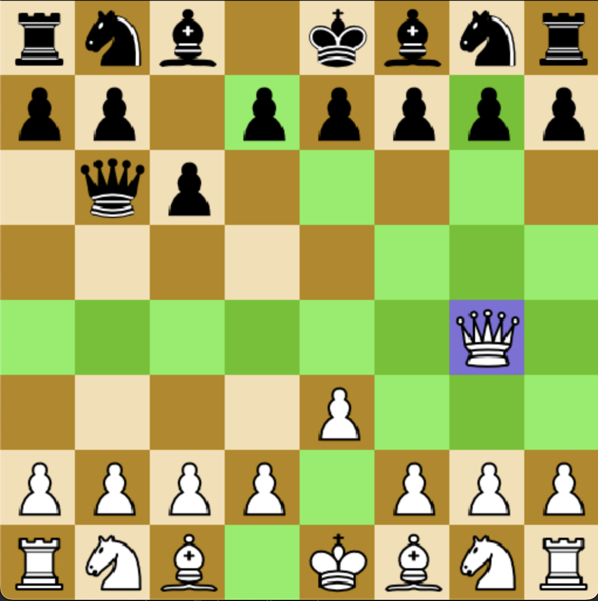

# Chess Game

## Table of Contents
1. [Introduction](#introduction)
2. [Features](#features)
3. [Installation](#installation)
4. [Usage](#usage)
5. [Screenshots](#screenshots)
6. [Gameplay Instructions](#gameplay-instructions)
7. [Technologies Used](#technologies-used)
9. [Contributing](#contributing)

---

## Introduction
This Chess Game is a Python-based implementation that allows two players to play chess against each other in a player vs. player (PvP) format. The game is built using Pygame, providing a graphical user interface (GUI) for players to interact with. The game engine processes moves, manages the game state, and ensures the rules of chess are followed. Players make moves by interacting with the GUI rather than typing commands in the terminal.

---

## Features
- **Player vs. Player (PvP)**: Allows two players to play against each other on the same device.
- **Graphical User Interface**: The game features a user-friendly interface built using Pygame for easy interaction.
- **Move validation**: Ensures that all moves follow chess rules.
- **Undo**: Players can undo moves during the game by pressing 'z'.
- **Reset**: Players can reset the game by pressing 'r'
- **Game state tracking**: Tracks the state of the game, including check, checkmate, and stalemate.
- **Customizable controls**: Players can interact with the chessboard using simple mouse clicks.
---

## Installation
To run the Chess game, you need to have Python and Pygame installed on your machine. Follow the steps below to get started.

1. **Clone the repository**:
   ```bash
   git clone https://github.com/toriibarnard/Chess-Game
   ```

2. **Install dependencies** (if any):
   The game might have additional libraries (e.g., for AI or GUI). Install them using pip:
   ```bash
   pip install -r requirements.txt
   ```

3. **Run the game**:
   Navigate to the directory containing the game files and run:
   ```bash
   python ChessMain.py
   ```

---

## Usage

Once you run the ChessMain.py script, the Pygame window will open, displaying the chessboard and allowing two players to interact with it. Players take turns to move pieces on the board by clicking on pieces and squares.

### Example Move:
1. **Select a piece**: Player 1 clicks on a piece to select it.
2. **Move a piece**: Player 1 clicks on the destination square to move the piece.
3. **Switch turns**: Player 2 repeats the same process on their turn.
4. **Undo a move**: Click 'z' on your keyboard to undo the last move.
5. **Exit**: Close the Pygame window to end the game session, or click 'r' on your keyboard to reset the game.

---

## Screenshots

### Screenshot 1: Start Screen


### Screenshot 2: Game Start


### Screenshot 3: In-Game Play


---

## Gameplay Instructions
1. **Objective**: The goal of the game is to checkmate your opponent's king. You win if the opponent's king has no legal moves left and is under attack (checkmate).
   
2. **Piece Movement**:
   - **Pawns** move forward one square, but capture diagonally. On their first move, they can move two squares.
   - **Rooks** move any number of squares vertically or horizontally.
   - **Knights** move in an "L" shape: two squares in one direction and one square perpendicular.
   - **Bishops** move diagonally any number of squares.
   - **Queens** move any number of squares in any direction.
   - **Kings** move one square in any direction.
   
3. **Game End**: The game ends when:
   - A checkmate occurs.
   - A draw is declared due to stalemate or insufficient material.

---

## Technologies Used
- **Python**: Programming language used for the development of the game.
- **Pygame**: Library used to build the graphical user interface (GUI) for the chessboard and gameplay.

---

## Contributing
We welcome contributions to improve the game! If you have suggestions or bug fixes, feel free to fork the repository and submit a pull request.

---
