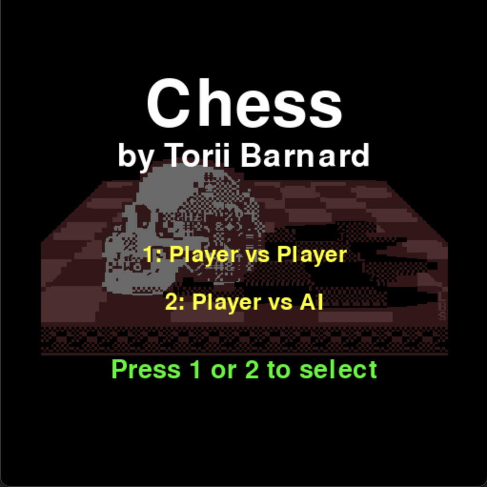

# Chess Game

## Table of Contents
1. [Introduction](#introduction)
2. [Features](#features)
3. [Installation](#installation)
4. [Usage](#usage)
5. [Screenshots](#screenshots)
6. [Gameplay Instructions](#gameplay-instructions)
7. [Special Chess Moves](#special-chess-moves)
8. [AI Opponent](#ai-opponent)
9. [Future Developments](#future-developments)
10. [Technologies Used](#technologies-used)
11. [Contributing](#contributing)

---

## Introduction
This Chess Game is a Python-based implementation that allows players to enjoy chess either against another player (PvP) or against an AI opponent. The game is built using Pygame, providing a graphical user interface (GUI) for players to interact with. The game engine processes moves, manages the game state, and ensures the rules of chess are followed. Players make moves by interacting with the GUI rather than typing commands in the terminal.

---

## Features
- **Player vs. Player (PvP)**: Allows two players to play against each other on the same device.
- **Player vs. AI**: Challenge yourself against a computer opponent using the Negamax algorithm with Alpha-Beta pruning.
- **Graphical User Interface**: The game features a user-friendly interface built using Pygame for easy interaction.
- **Move validation**: Ensures that all moves follow chess rules.
- **Undo**: Players can undo moves during the game by pressing 'z'.
- **Reset**: Players can reset the game by pressing 'r'.
- **Return to Menu**: After a game ends, press 'm' to return to the start screen.
- **Game state tracking**: Tracks the state of the game, including check, checkmate, and stalemate.
- **Customizable controls**: Players can interact with the chessboard using simple mouse clicks.
---

## Installation
To run the Chess game, you need to have Python and Pygame installed on your machine. Follow the steps below to get started.

1. **Clone the repository**:
   ```bash
   git clone https://github.com/toriibarnard/Chess-Game
   ```

2. **Install dependencies** (if any):
   The game might have additional libraries (e.g., for AI or GUI). Install them using pip:
   ```bash
   pip install -r requirements.txt
   ```

3. **Run the game**:
   Navigate to the directory containing the game files and run:
   ```bash
   python ChessMain.py
   ```

---

## Usage

Once you run the ChessMain_modified.py script, the Pygame window will open, displaying the start screen. You can choose to play against another player or against the AI.

### Game Mode Selection:
1. **Press '1'**: To play Player vs. Player mode.
2. **Press '2'**: To play against the AI (you'll play as White).

### Example Move:
1. **Select a piece**: Click on a piece to select it.
2. **Move a piece**: Click on a highlighted destination square to move the piece.
3. **Switch turns**: In PvP mode, the other player repeats the same process. In AI mode, the computer will automatically make its move.
4. **Undo a move**: Press 'z' on your keyboard to undo the last move.
5. **Reset the game**: Press 'r' on your keyboard to reset the board.
6. **Return to menu**: After a game ends, press 'm' to return to the start screen.
7. **Exit**: Close the Pygame window to end the game session.

---

## Screenshots

### Screenshot 1: Start Screen


### Screenshot 2: Game Start


### Screenshot 3: In-Game Play


---

## Gameplay Instructions
1. **Objective**: The goal of the game is to checkmate your opponent's king. You win if the opponent's king has no legal moves left and is under attack (checkmate).
   
2. **Piece Movement**:
   - **Pawns** move forward one square, but capture diagonally. On their first move, they can move two squares.
   - **Rooks** move any number of squares vertically or horizontally.
   - **Knights** move in an "L" shape: two squares in one direction and one square perpendicular.
   - **Bishops** move diagonally any number of squares.
   - **Queens** move any number of squares in any direction.
   - **Kings** move one square in any direction.
   
3. **Game End**: The game ends when:
   - A checkmate occurs.
   - A draw is declared due to stalemate or insufficient material.

---

## Special Chess Moves

#### In addition to the standard chess moves, this game also supports the following special moves:

- **En Passant**:
If a pawn moves two squares forward from its starting position and lands next to an opponent's pawn, the opponent's pawn can capture it as if it had only moved one square forward. This capture must be made immediately after the two-square move.


- **Pawn Promotion**:
When a pawn reaches the opponent's back rank (the 8th rank for white or the 1st rank for black), it can be promoted to any other piece (queen, rook, bishop, or knight), except a king. This promotion is triggered automatically when the pawn reaches the promotion square.


- **Castling**:
Castling is a move involving the king and either rook. To castle, the king and rook must not have moved previously, and the squares between them must be empty. The king moves two squares toward the rook, and the rook moves to the square next to the king on the opposite side. Castling can only occur if the king is not in check and does not move through or land on a square that is under attack.

---

## AI Opponent

The game now features an AI opponent that uses advanced chess algorithms to provide a challenging experience:

### AI Implementation Details:

- **Negamax Algorithm**: A variant of the minimax algorithm that simplifies implementation by using the fact that max(a, b) = -min(-a, -b) in zero-sum games like chess.

- **Alpha-Beta Pruning**: An optimization technique that significantly reduces the number of board positions evaluated by the AI by "pruning" branches that cannot influence the final decision.

- **Position Evaluation**: The AI evaluates chess positions using several factors:
  - **Material Value**: Each piece has a standard value (pawn=10, knight=30, bishop=30, rook=50, queen=90, king=900)
  - **Piece Position Tables**: Each piece type has a position table that assigns values to different squares on the board
  - **Mobility**: Considers the number of legal moves available
  - **Game Phase Detection**: Adjusts strategy based on whether the game is in an opening, middle, or endgame phase

- **Search Depth**: The default search depth is set to 3, which provides a balance between performance and strength. This means the AI looks ahead 3 moves (considering both player and AI moves).

### Playing Against the AI:

1. Select "Player vs AI" (press '2') on the start screen
2. You will play as White, and the AI will play as Black
3. When it's the AI's turn, you'll see "AI thinking..." displayed, and then the AI will make its move
4. If you press 'z' to undo a move, the game will undo both your move and the AI's move

---

## Future Developments

- **AI Difficulty Levels**: Implement easy, medium, and hard AI difficulty settings for players of different skill levels.
- **Opening Book**: Add pre-programmed openings to improve the AI's early game play.
- **Time Controls**: Implement chess clocks and various time control options.
- **Online Multiplayer**: Allow players to compete against each other over the internet.
- **Save/Load Games**: Ability to save games in progress and load them later.

---

## Technologies Used
- **Python**: Programming language used for the development of the game.
- **Pygame**: Library used to build the graphical user interface (GUI) for the chessboard and gameplay.
- **Negamax Algorithm**: Used for the AI's decision-making process.
- **Alpha-Beta Pruning**: Optimization technique for the AI's search algorithm.

---

## Contributing
We welcome contributions to improve the game! If you have suggestions or bug fixes, feel free to fork the repository and submit a pull request.

---
